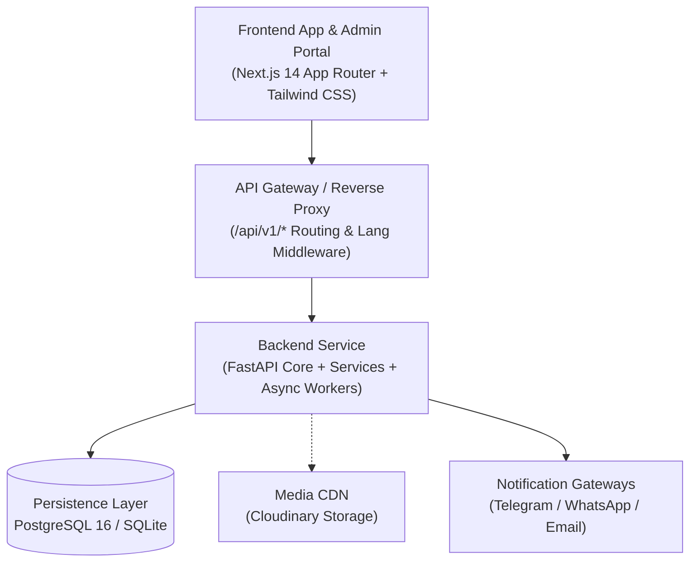

# AutoRentGo

<p align="center">
  <strong>Open-source foundation and extensible platform for building vehicle, equipment, and asset rental marketplaces.</strong>
</p>

<p align="center">
  <a href="LICENSE"></a>
  <a href=".github/workflows/test.yml"></a>
  <a href="https://fastapi.tiangolo.com/"></a>
  <a href="https://nextjs.org/"></a>
  <a href="https://www.python.org/"></a>
  <a href="https://www.docker.com/"></a>
</p>

---

## Overview

**AutoRentGo is an open-source foundation for building rental platforms.** Rather than an inflexible single-purpose app, AutoRentGo is designed as a **reusable developer framework and production-ready reference platform** for asset sharing and rental marketplaces.

Whether you are launching a regional peer-to-peer car sharing service, a commercial fleet leasing system, industrial equipment rentals, or marine transport operations, AutoRentGo delivers a robust, secure, and extensible starting point.

---

## Features

- 🚗 **Vehicle & Fleet Management**: Complete lifecycle tracking for passenger cars, commercial transport, and special machinery with multi-status state machines (`ACTIVE`, `AWAIT`, `DRAFT`, `REJECT`, `DELETED`).
- 🚜 **Equipment & Asset Support**: Multi-category support with dynamic attributes, technical specifications, and rental pricing models.
- 🎯 **Automated Request Matching**: Customers submit rental applications with desired criteria; the matching engine automatically connects requests with matching fleet listings.
- ⚡ **High-Performance REST API**: Built on **FastAPI** with async execution, strict **Pydantic v2** validation, and autogenerated OpenAPI documentation.
- 🌐 **Multilingual Taxonomy Engine**: Hierarchical dictionary system (Brands, Models, Categories, Cities, Fuel Types) with real-time translation support (English, Russian, Kazakh).
- 🔐 **Authentication & RBAC**: Stateless JWT auth, Bcrypt password hashing, and phone/email one-time password (OTP) verification.
- 💳 **Fleet Subscriptions & Billing**: Built-in subscription tiers, limits on active listings, and payment transaction tracking.
- 📣 **Multi-Channel Notifications**: Integrated notification dispatchers for **Telegram** admin alerts, **WhatsApp** messaging, and **SMTP** emails.
- 🐳 **Production-Ready Docker**: Containerized stack with automated healthchecks, volume persistence, and dependency orchestration.
- 🗄️ **Dual-Database Portability**: Runs with **PostgreSQL 16** in production and seamlessly defaults to **SQLite** for rapid zero-config local development and testing.
- 🧩 **Extensible Architecture**: Clean separation between API routers, domain entities, and third-party service providers.

---

## Architecture

AutoRentGo follows a decoupled, layered architecture:



Detailed architectural blueprints, sequence diagrams, and entity-relationship models are documented in [docs/architecture.md](docs/architecture.md).

---

## Tech Stack

| Domain | Technologies |
|---|---|
| **Backend** | Python 3.11+, FastAPI 0.115, Uvicorn, SQLAlchemy 2.0, Alembic, Pydantic v2 |
| **Frontend** | Next.js 14 (App Router), TypeScript, React 18, Tailwind CSS, Radix UI, Lucide React, Zustand, React Query |
| **Database** | PostgreSQL 16 (production), SQLite (local dev & testing) |
| **Authentication** | JWT (python-jose), Passlib (Bcrypt), OTP Verification |
| **Media & Storage** | Cloudinary CDN with automatic cascade cleanup |
| **Notifications** | Telegram Bot API, WhatsApp Gateway (HTTPX), aiosmtplib + Jinja2 |
| **DevOps & CI** | Docker, Docker Compose, GitHub Actions CI, Pytest |

---

## Quick Start

### 1. Launch with Docker Compose (Recommended)

Get the entire stack (PostgreSQL + FastAPI + Next.js) running in under 2 minutes:

```bash
# 1. Clone repository
git clone https://github.com/Omarigato/AutoRentGo.git
cd AutoRentGo

# 2. Copy environment template
cp .env.example .env

# 3. Build and launch containers
docker compose up --build
```

Once running, access:
- **Frontend Client**: [http://localhost:3000](http://localhost:3000)
- **Backend API**: [http://localhost:8000/api/v1](http://localhost:8000/api/v1)
- **Interactive Swagger Docs**: [http://localhost:8000/docs](http://localhost:8000/docs)
- **ReDoc Documentation**: [http://localhost:8000/redoc](http://localhost:8000/redoc)

---

### 2. Native Local Development

#### Backend (FastAPI)
```bash
cd back

# Create and activate virtual environment
python -m venv venv
source venv/bin/activate  # On Windows: .\venv\Scripts\Activate.ps1

# Install dependencies
pip install -r requirements-dev.txt

# Initialize database schema and seed default dictionaries (SQLite by default)
python -m app.init_db

# Start development server
uvicorn app.main:app --reload --host 0.0.0.0 --port 8000
```

#### Frontend (Next.js)
```bash
cd ../front

# Install dependencies and start dev server
npm install
npm run dev
```

---

## Environment Setup

AutoRentGo ships with a sanitized environment template containing sensible defaults and zero exposed secrets:

```bash
cp .env.example .env
```

Key environment variables in `.env`:

| Variable | Description | Default |
|---|---|---|
| `APP_NAME` | Name of the platform instance | `AutoRentGo` |
| `BACKEND_PORT` | Port for the FastAPI application | `8000` |
| `SECRET_KEY` | Secret key for JWT signing | *Random 32-byte hex string* |
| `SQLALCHEMY_DATABASE_URI` | Database connection string (Postgres or SQLite) | `sqlite:///./autorentgo.db` (fallback) |
| `NEXT_PUBLIC_API_BASE_URL` | Base API path consumed by the frontend | `/api/v1` |
| `SMTP_HOST` | SMTP server for email notifications (optional) | - |
| `TELEGRAM_NOTIFICATION_BOT_TOKEN` | Bot token for Telegram notifications (optional) | - |

Refer to [.env.example](.env.example) for the full list of configuration options.

---

## API Documentation

AutoRentGo provides interactive OpenAPI documentation out of the box:

- **Swagger UI**: [http://localhost:8000/docs](http://localhost:8000/docs)
- **ReDoc Interface**: [http://localhost:8000/redoc](http://localhost:8000/redoc)
- **OpenAPI JSON Schema**: [http://localhost:8000/api/v1/openapi.json](http://localhost:8000/api/v1/openapi.json)

For curl examples and sample request/response payloads, see the [Developer Demo Guide](docs/demo.md).

---

## Automated Testing

AutoRentGo includes a comprehensive test suite covering authentication, catalog queries, multilingual dictionaries, and rental booking requests:

```bash
# Run tests from project root or back/ directory
pytest -v
```

All tests execute against an isolated in-memory SQLite database, guaranteeing fast execution with zero external service dependencies.

---

## Roadmap

### v1.0 (Core Production Foundation)
- [x] JWT authentication & OTP verification
- [x] Role-based access control (Client, Owner, Admin)
- [x] Asset catalog with multi-facet filtering
- [x] Booking application & matching engine
- [x] Multi-channel notifications (Telegram, WhatsApp, Email)
- [ ] Native Stripe and regional payment provider checkout
- [ ] WebSockets for real-time application updates
- [ ] Automated rental agreement PDF generation

### v1.1 (AI & Autonomous Operations)
- [ ] **AI Assistant**: Natural language search and booking assistant
- [ ] **Smart Search**: Semantic search powered by vector embeddings
- [ ] **Dynamic Pricing Recommendations**: AI pricing suggestions based on seasonal demand
- [ ] **Automated Inspection**: Computer vision analysis of vehicle condition photos

---

## Contributing

We welcome contributions from the community! Please read our [Contributing Guide](CONTRIBUTING.md) and [Code of Conduct](CODE_OF_CONDUCT.md) before submitting pull requests.

Check out our [open issues](https://github.com/Omarigato/AutoRentGo/issues) or submit a feature request.

---

## Security

To report a security vulnerability, please review our [Security Policy](SECURITY.md) and email [security@autorentgo.org](mailto:security@autorentgo.org).

---

## License

This project is open-source and licensed under the [MIT License](LICENSE) &copy; 2026 Omarigato.
