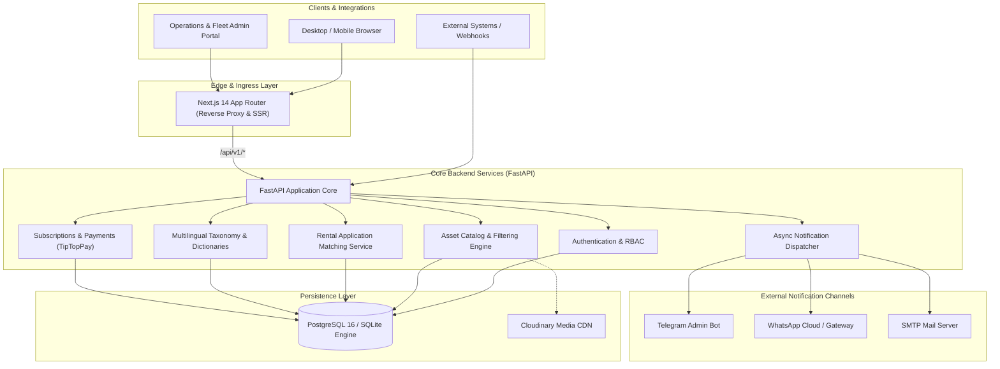
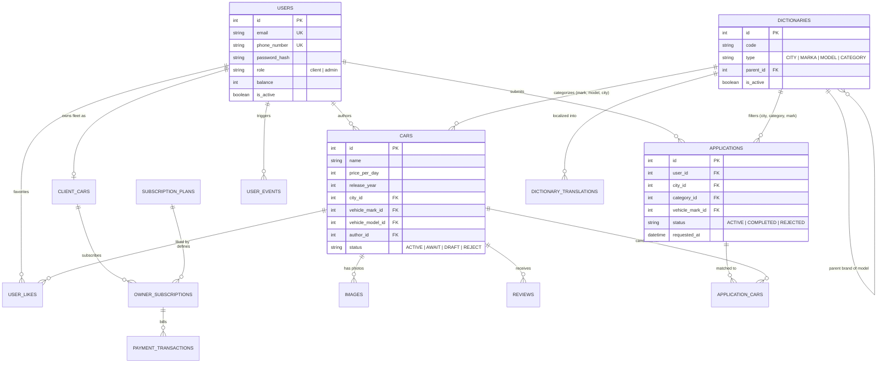
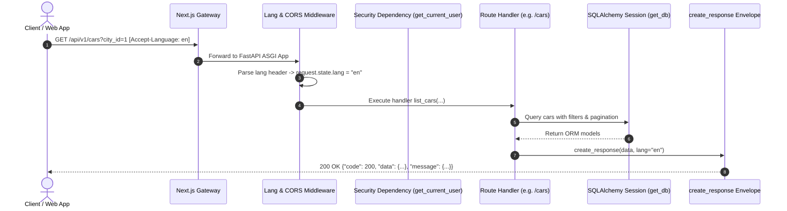
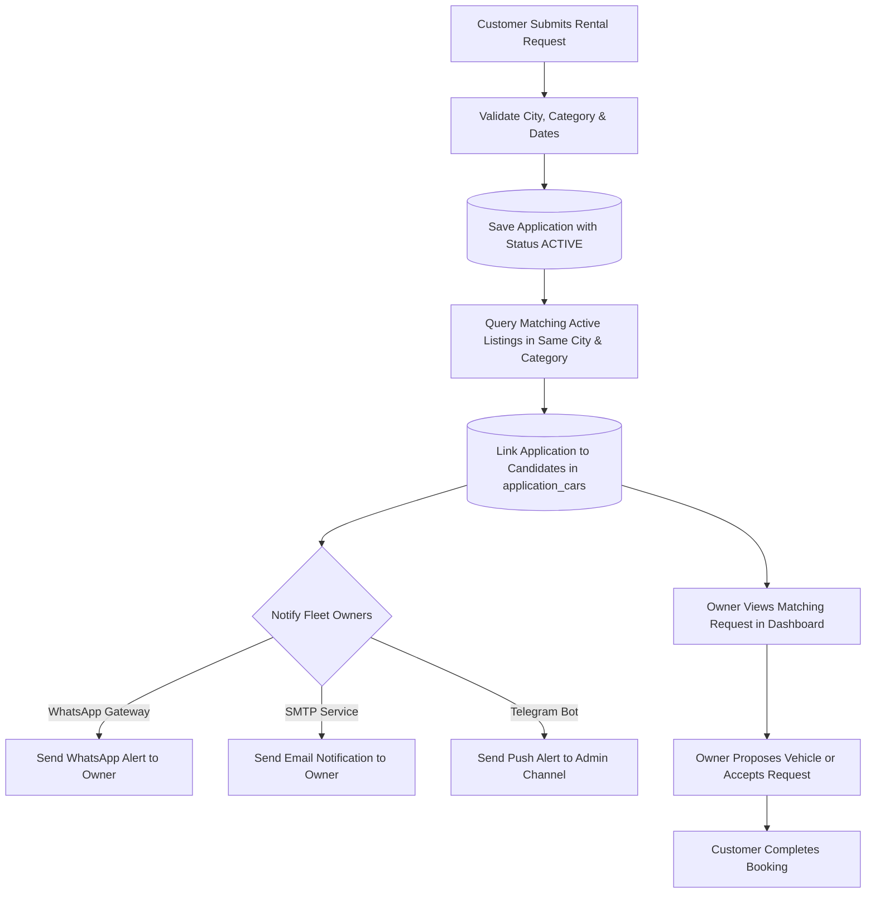

# AutoRentGo System Architecture & Design

Welcome to the technical architecture document for **AutoRentGo** — an open-source, modular platform and developer framework designed for building scalable vehicle, equipment, and asset rental marketplaces.

---

## 1. High-Level System Architecture

AutoRentGo employs a decoupled, multi-tier architecture designed for containerized deployment, high developer velocity, and horizontal scalability.

---

## 2. Backend Architecture & Clean Modularity

The backend is built with **FastAPI** on Python 3.11+, leveraging modern asynchronous ASGI paradigms, strict Pydantic v2 schemas, and dependency injection.

### 2.1 Layered Responsibilities
- **`app/main.py`**: Application factory (`create_app`), global CORS middleware, language negotiation middleware (`Accept-Language` / `?lang=`), and OpenAPI schema orchestration.
- **`app/api/v1/`**: Modular API endpoints grouped by domain:
  - `auth`: JWT registration, OTP verification, credential login, user profile `/me`.
  - `cars`: Vehicle listings, multi-parameter filtering, media upload, lifecycle status (`ACTIVE`, `AWAIT`, `DRAFT`, `REJECT`).
  - `applications`: Customer rental requests and matching logic.
  - `dictionaries`: Hierarchical taxonomy (vehicle brands, models, categories, cities, transmissions, fuel types).
  - `subscriptions` & `admin`: Subscription tier management, fleet owner billing, and platform moderation.
- **`app/core/`**: Cross-cutting concerns including security (Bcrypt, JWT tokens), structured logging, i18n translation maps, standard response factories (`create_response`), and Pydantic configuration.
- **`app/services/`**: Isolated integration layers (Cloudinary media manager, WhatsApp gateway client, Telegram bot webhook, SMTP mail delivery, TipTopPay billing).

---

## 3. Database Layer & Domain Model

The persistence layer uses **SQLAlchemy 2.0** with strict type annotations (`Mapped[...]` and `mapped_column`) and supports both **PostgreSQL** in production and **SQLite** for rapid local development and automated testing.

### 3.1 Entity-Relationship Diagram (ERD)

---

## 4. API Request & Data Flow

Every inbound HTTP request flows through a unified request pipeline ensuring internationalization, authentication, and standard JSON response envelopes.

---

## 5. Rental Application & Matching Workflow

The platform's standout functional core is its **automated matching engine**: when a customer requires equipment or a vehicle, owners with compatible listings are automatically matched and alerted.

---

## 6. Authentication & Security Model

- **Stateless Tokens**: Signed using HMAC SHA-256 (`HS256`) with a configurable expiration window.
- **Credential Storage**: Bcrypt cryptographic hashing via Passlib with automatic salt generation.
- **Two-Factor / Passwordless OTP Verification**: Time-bounded one-time passwords (`otp_verifications`) expiring in 10 minutes for phone and email identity validation.
- **Role-Based Access Control (RBAC)**: Distinct authorization scopes (`client`, `owner`, `admin`) enforced using FastAPI dependencies (`get_current_user`, `get_current_owner`).

---

## 7. Future Scalability & Extensibility Roadmap

AutoRentGo is architected as an extensible foundation ready for high concurrency:

1. **Read/Write Persistence Splitting**:
   - Primary PostgreSQL instance for ACID transaction writes.
   - Read replicas for catalog searches and dictionary queries.
2. **Caching Tier (Redis)**:
   - Redis caching for frequently queried dictionary taxonomies and top vehicle listings.
3. **Asynchronous Worker Queues**:
   - Transitioning from FastAPI in-process `BackgroundTasks` to Celery / ARQ with Redis / RabbitMQ brokers for high-volume notification bursts.
4. **Storage Abstraction (S3 / MinIO / Cloudflare R2)**:
   - Pluggable storage backend interface allowing self-hosted S3-compatible object stores alongside Cloudinary.
5. **AI Assistant Integration (Roadmap v1.1)**:
   - Natural language vehicle search, automated condition analysis from photos, and smart pricing recommendations.
